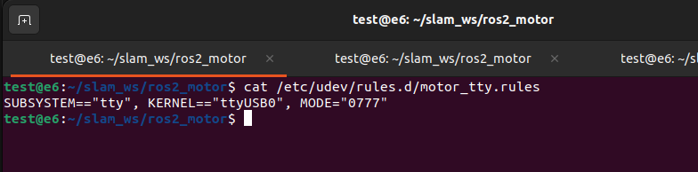

## 操作说明

### 电机驱动

在 /etc/udev/rules.d/ 路径下添加规则,如图:

```
SUBSYSTEM=="tty", KERNEL=="ttyUSB0", MODE="0777"
```



或者先给权限

```bash
sudo chmod 777 /dev/ttyUSB0
```

编译

```bash
colcon build --symlink-install
```

```bash
source install/setup.bash
```

启动

```bash
ros2 launch motor_pkg motor_driver.launch.py 
```


### 手柄使用


说明:

左摇杆:		控制线速度

右摇杆:		控制角速度

A按键: 		切换模式: 自动模式和手动模式

B按键: 		锁轴/停机

RB 右肩键:	使能 手动模式下需要按住

LB 左肩键:	速度档位切换

自定义按键